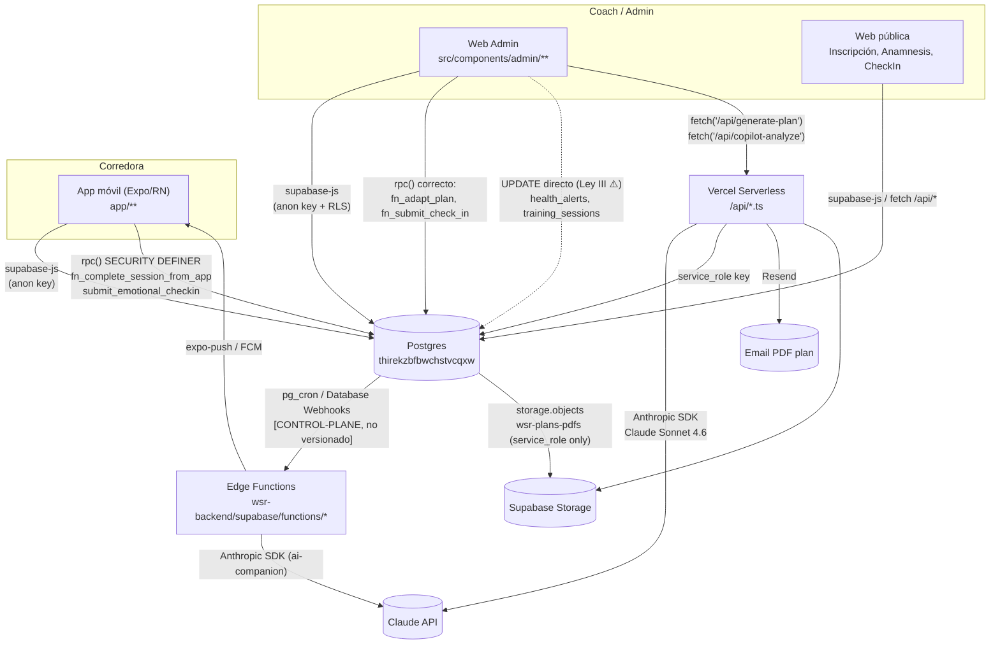

# WSR — Auditoría de Arquitectura Holística y Mapa de Dependencias

> Generado el 2026-07-02 mediante reconocimiento estático de los 3 repositorios
> (`wsr-backend`, `Web/womansocialrun-main`, `App/wsr-app`). Metodología Zero-Guessing:
> toda afirmación cita archivo:línea verificado o comando ejecutado. Donde el estado del
> plano de control (cron real, deploys reales, RLS en vivo) no es auditable desde el
> repo, se marca explícitamente como tal.
>
> Este documento **no reemplaza** los audits previos — los complementa y actualiza:
> - [`App/wsr-app/docs/SYSTEM_ARCHITECTURE_STATE.md`](../../App/wsr-app/docs/SYSTEM_ARCHITECTURE_STATE.md) (2026-06-15)
> - [`App/wsr-app/docs/STATE_OF_THE_UNION_WSR_v1.0.md`](../../App/wsr-app/docs/STATE_OF_THE_UNION_WSR_v1.0.md) (2026-06-14)
> - [`App/wsr-app/docs/DATABASE_UNIFICATION_STRATEGY_v1.0.md`](../../App/wsr-app/docs/DATABASE_UNIFICATION_STRATEGY_v1.0.md) (2026-06-14)
> - [`WSR_ECOSYSTEM_GOVERNANCE.md`](../WSR_ECOSYSTEM_GOVERNANCE.md) (vigente desde 2026-07-02)
>
> El hallazgo central de junio — **el silo App/Web sobre dos proyectos Supabase
> distintos** — ya no está vigente (ver §1). Lo que sigue abierto es más sutil: dos
> repos que aún actúan como dueños independientes de `supabase/migrations/`.

---

## 1. Mapa de arquitectura actual

### 1.1 Topología (confirmada hoy, evidencia runtime, no solo config)

| Repo | Rol | Proyecto Supabase runtime | Evidencia |
|---|---|---|---|
| `wsr-backend` | Cerebro único: Edge Functions, migraciones SQL, `@wsr/contracts` | `thirekzbfbwchstvcqxw` | `supabase/config.toml` |
| `Web/womansocialrun-main` | Cliente Vite/React (landing pública + panel coach/admin) | `thirekzbfbwchstvcqxw` | `.env`: `VITE_SUPABASE_URL`, comentario *"FASE 4 switchover... La key del WEB deprecado fue retirada"* |
| `App/wsr-app` | Cliente Expo/React Native (corredoras) | `thirekzbfbwchstvcqxw` | `.env.local`: `EXPO_PUBLIC_SUPABASE_URL` |

**Confirmado por inspección directa:** ambos clientes apuntan hoy al mismo proyecto
(`thirekzbfbwchstvcqxw`, el que los docs de junio llamaban "APP canónico"). El proyecto
`kkgfszhcyrqjzgxxlsem` ("WEB deprecado") ya no aparece en código runtime de ningún
cliente — el cliente dual `app_client.ts` de Web fue eliminado y sus env vars
(`VITE_APP_SUPABASE_*`) purgadas. Este era el **hallazgo P0 más grave** de
`STATE_OF_THE_UNION_WSR_v1.0.md` §"DIAGNÓSTICO CRÍTICO: EL SILO APP-WEB" — **está resuelto
en la capa de infraestructura**, aunque persisten preguntas de datos abiertas (§5.4).

### 1.2 Diagrama de flujo de datos

**Puntos de fricción del diagrama** (detalle en §4):
- Las líneas punteadas (`Ley III ⚠️`) son mutaciones directas de cliente sobre tablas
  clínicas — deberían ser RPC `SECURITY DEFINER`, no lo son hoy.
- El disparo de `pg_cron`/webhooks hacia Edge Functions **no es verificable desde
  el repo** (confirmado también por `SYSTEM_ARCHITECTURE_STATE.md` §3.1/§6): vive en
  el dashboard de Supabase, fuera de control de versiones.

---

## 2. Inventario de servicios

### 2.1 Edge Functions (`wsr-backend/supabase/functions/`, 11 activas)

| Función | Disparador declarado | LLM |
|---|---|---|
| `adherence-engine` | Cron diario 05:00 UTC (`[CONTROL-PLANE]`) | ❌ algorítmico (ARS 0-100) |
| `ai-companion` | Usuaria in-app, JWT | ✅ Anthropic |
| `confirmar-inscripcion` | Público (token) | ❌ |
| `delete-account` | Usuaria autenticada | ❌ |
| `dynamic-responder` | — | ❌ |
| `emotional-reactivation` | Cron diario | ❌ copy plantillado |
| `enviar-bienvenida` | Trigger de registro | ❌ |
| `post-training-survey` | Cron semanal | ❌ |
| `push-message-notify` | Webhook `INSERT messages` | ❌ |
| `send-push-notification` | Webhook `INSERT notifications` | ❌ |
| `send-training-reminder` | Cron diario | ❌ |

Todas ubicadas exclusivamente en `wsr-backend`. Ni Web ni App tienen carpeta
`supabase/functions/` propia (verificado por `find` recursivo en ambos repos, cero
resultados salvo `node_modules` y artefactos de build de Vercel — irrelevantes).

### 2.2 Vercel Serverless (`Web/womansocialrun-main/api/`, 13 funciones + 1 cron)

| Función | Propósito | Auth | LLM |
|---|---|---|---|
| `generate-plan.ts` | Genera mesociclo 4 semanas | Bearer JWT coach | ✅ Claude Sonnet 4.6 |
| `copilot-analyze.ts` | `analyze` + `adapt` sobre plan activo | Bearer JWT coach | ✅ Claude Sonnet 4.6 |
| `deliver-plan.ts` | PDF (`@react-pdf/renderer`) + email (Resend) | Bearer JWT coach | ❌ |
| `save-profile.ts` | Upsert `runners` desde inscripción pública | service_role | ❌ |
| `send-anamnesis-invite.ts`, `send-followup-emails.ts`, `send-winner-code.ts`, `send-ambassador-agreement.ts` | Emails transaccionales | Bearer JWT coach | ❌ |
| `ambassador-agreement.ts`, `get-ambassador-agreement.ts`, `accept-ambassador-agreement.ts` | Flujo de contrato embajadoras | service_role + token | ❌ |
| `claim-race-code.ts` | Reclamo de código de sponsor | service_role + validación | ❌ |
| `posthog-proxy.ts` | Relay de analítica privacy-preserving | Bearer JWT coach | ❌ |
| `cron/birthdays.ts` | Mensajes de cumpleaños | Cron Vercel | ❌ |

No se detectó ninguna `service_role` key embebida en código de cliente (`src/`) — las
únicas apariciones están en funciones serverless (`api/*.ts`), que corren server-side.

### 2.3 Modelos de datos — dueños actuales

| Ámbito | Tablas | Dueño de migración |
|---|---|---|
| Identidad app / social | `user_profiles`, `trainings`, `registrations`, `weekly_checkins`, `activities`, `messages`, `channels`, `social_feed` | `App/wsr-app/supabase/migrations/001`–`037` |
| Clinical Core (coaching) | `runners`, `plans`, `training_weeks`, `plan_sessions`/`training_sessions`, `session_results`, `anamnesis`, `scores`, `adherence_scores`, `health_alerts` | **Dividido** — ver §4.1 |
| Storage | bucket `wsr-plans-pdfs` | `wsr-backend/supabase/migrations/044_wsr_plans_pdfs_bucket.sql` *(sin commit — ver §4.4)* |
| Legacy | `personal_trainings` | `App/wsr-app/supabase/migrations/012_personal_trainings.sql` |

---

## 3. Mapa de dependencias — qué se rompe si tocas un módulo core

| Módulo core | Si lo modificas sin coordinar, rompe... |
|---|---|
| `plans` / `training_weeks` / `plan_sessions` (schema) | `App` `hooks/usePlanSessions.ts` (RPC `get_my_active_plan`, `fn_complete_session_from_app`) · `Web` `PlanesPersonalesTab.tsx` (3.300+ líneas, split-view coach) · `api/generate-plan.ts` · `api/copilot-analyze.ts` · `api/deliver-plan.ts` |
| `fn_complete_session_from_app` (RPC) | Único punto de escritura de telemetría de sesión desde la app — `SessionCompleteSheet.tsx` → `usePlanSessions.ts:148`. Si cambia su firma, la app deja de poder cerrar sesiones de plan sin fallar silenciosamente. |
| `health_alerts` (schema/RLS) | `CheckInsTab.tsx` (lee y **escribe directo**, ⚠️ §4.2) · `fn_submit_check_in` (trigger `fn_check_in_adaptation()`) · futura pantalla de alertas en App (aún no existe, es un P1 de `STATE_OF_THE_UNION`) |
| `runners` vs `user_profiles` (identidad) | Doble entidad de identidad ya documentada como tensión sin resolver (`SYSTEM_ARCHITECTURE_STATE.md` §5.1). Cualquier RPC que asuma una sola de las dos rompe al otro cliente. `adherence-engine` consulta `runners`; App opera sobre `user_profiles.id`. |
| `personal_trainings` (legacy) | Coexiste en paralelo con `plans/*` en App (`usePersonalTrainings.ts` + `useCompleteSession.ts:67-76` mutan directo). Web también le escribe (`PersonalPlanesTab.tsx:304`). Eliminarla sin auditar rompe dos UIs activas simultáneamente. |
| `@wsr/contracts` (`contracts/database.types.ts`) | Consumido como dependencia de archivo local (`file:../../wsr-backend`) por **ambos** clientes (`Web/package.json`, `App/package.json:21`). Regenerar sin `npm install` en ambos clientes deja tipos desincronizados silenciosamente (no hay lockfile que fuerce el refresh). |
| `supabase/migrations/` (numeración) | Ver §4.1 — el mayor riesgo estructural del sistema hoy. |

---

## 4. Inconsistencias y riesgos arquitectónicos (priorizado)

### 🔴 P0 — Riesgo activo, no resuelto

**4.1 Doble dueño de `supabase/migrations/` — violación directa de la Ley I**

`App/wsr-app/supabase/migrations/` (50 archivos, `001`–`050`) y
`wsr-backend/supabase/migrations/` (`001`–`044` + `20260702135944_remote_schema.sql`)
son **dos historiales de migración independientes que ambos apuntan al mismo proyecto
Supabase** (`thirekzbfbwchstvcqxw`). Evidencia concreta de colisión:

| Número | `App/wsr-app` | `wsr-backend` |
|---|---|---|
| `044` | `044_adherence_cron_hardening.sql` | `044_wsr_plans_pdfs_bucket.sql` |

Además, dentro del propio historial de App persisten (confirmado post-merge de hoy):
duplicado `009` (`009_notifications.sql` + `009_roles_and_permissions.sql`), duplicado
`012` (`012_personal_trainings.sql` + `012_remove_free_run_points.sql`), hueco `023`
(salta de `022` a `024`).

**Por qué importa:** si alguien corre `supabase db push` desde `App/wsr-app` y otra
persona lo corre desde `wsr-backend`, cada CLI cree tener la verdad completa del
esquema. No hay forma de derivar del nombre del archivo cuál `044` se aplicó realmente
en producción. Esto es exactamente el vector de "Cerebro Distribuido" que motivó la
Ley I — pero aplicado a migraciones, no a Edge Functions (que sí se centralizaron
correctamente hoy).

**Nota histórica:** este archivo `044_adherence_cron_hardening.sql` de App aparenta
resolver el hallazgo de junio "cron del Adherence Engine no versionado"
(`SYSTEM_ARCHITECTURE_STATE.md` §3.1) — pero lo hizo en el repo equivocado según la
Ley I vigente desde hoy.

**4.2 Mutaciones directas sobre tablas clínicas en Web Admin — violación de Ley III**

Confirmado en el cliente Web (App está limpio, ver §4.1 de su propio audit — cero
violaciones detectadas):

| Archivo:línea | Tabla | Operación | RPC existente que debería usarse |
|---|---|---|---|
| `src/components/admin/CheckInsTab.tsx:252-259` | `health_alerts` | `UPDATE status='atendida'` directo | No existe — falta crear `fn_resolve_health_alert()` |
| `src/components/admin/PlanesPersonalesTab.tsx:2534-2537` | `training_sessions` | `UPDATE` directo (edición inline de coach) | No existe — falta `fn_update_training_session()` con guardas |
| `src/components/admin/AnamnesisTab.tsx:850` | `anamnesis` | `DELETE` directo | No existe |
| `src/components/admin/AnamnesisTab.tsx:1538-1539` | `anamnesis` | `UPDATE`/`INSERT` directo | No existe |
| `src/pages/Anamnesis.tsx:629` | `anamnesis` | `INSERT` directo | Mitigado parcialmente por `fn_validate_anamnesis_token`, pero la escritura en sí es directa |

Esto contradice explícitamente `WSR_ECOSYSTEM_GOVERNANCE.md` Ley III: *"Toda
modificación clínica... se encapsula en una función RPC `SECURITY DEFINER`"*. El hecho
de que compile en TypeScript no es evidencia de que sea seguro — la propia Ley III lo
advierte en su último punto.

### 🟠 P1 — Deuda con impacto en roadmap social (Feed/GPS/Chat)

**4.3 Sistema dual `personal_trainings` (legacy) vs `plans/plan_sessions` (nuevo) en App**

`hooks/usePersonalTrainings.ts` y `hooks/usePlanSessions.ts` coexisten activos en
navegación (`app/(tabs)/entrenamientos/index.tsx:245-263` renderiza el fallback legacy
cuando no hay plan activo). Ninguno está marcado como deprecado. Antes de construir
Feed social sobre "entrenamientos completados", hay que decidir cuál de las dos fuentes
alimenta el feed — hoy el trigger de auto-post (`vw_social_feed`, mig `033`) probablemente
solo escucha una de las dos tablas, lo que puede generar publicaciones inconsistentes o
duplicadas en el Feed cuando se construya.

**4.4 Higiene de gobernanza — migración sin commit en `wsr-backend`**

`wsr-backend/supabase/migrations/044_wsr_plans_pdfs_bucket.sql` existe en disco pero
**nunca se hizo `git add`/`commit`** (confirmado: `git status` lo reporta como `??`
sin rastrear). El bucket puede estar desplegado en producción sin que el repo lo
refleje — el mismo síntoma de "Dependencia Humana" que este documento busca erradicar,
aplicado al propio repo que se supone es el Cerebro Único.

**4.5 Estado real del ETL de unificación de datos — no verificable con certeza desde el repo**

`App/wsr-app/scripts/unification_etl.ts` (769 líneas, idempotente, soporta `DRY_RUN`)
implementa la Fase 2 (export/import) de
`DATABASE_UNIFICATION_STRATEGY_v1.0.md`. El script no tiene marcador de "completado" ni
está archivado. Sin embargo, evidencia runtime **más reciente que el script** (§1.1:
`.env` de Web ya sin cliente dual, comentario explícito de "FASE 4 switchover"
ejecutada) sugiere que al menos la Fase 4 (client switchover) sí se ejecutó. Esto es
contradictorio en apariencia y **debe confirmarse con quien ejecutó el switchover**:
¿se corrió el ETL de datos (Fase 2) antes de apagar el proyecto WEB, o el switchover de
config se hizo primero y los datos históricos de `kkgfszhcyrqjzgxxlsem` quedaron atrás?
Si es lo segundo, hay corredoras/coaches del proyecto WEB legado cuyos datos podrían no
existir en `thirekzbfbwchstvcqxw`. Esto **no es auditable desde código estático** — es
una pregunta de estado de base de datos en vivo.

### 🟡 P2 — Deuda de mantenibilidad, no bloqueante

**4.6 Tipos de dominio duplicados en Web (Ley II parcial)**

6 archivos redeclaran a mano estructuras que ya existen en `@wsr/contracts`:
`PlanesPersonalesTab.tsx:27-109`, `DireccionTab.tsx:20-51`, `PersonalPlanesTab.tsx:19-61`,
`Admin.tsx:62-100`, `ReportesTab.tsx`, `RunnerProfileModal.tsx`. Riesgo bajo (los campos
coinciden con el schema hoy) pero sin garantía de que sigan coincidiendo tras el próximo
`gen:types`. Nada de esto ocurre en App — su `types/app.types.ts:13` importa
`Tables/Enums/Database` de `@wsr/contracts` y solo aplica *narrowing* de enums, patrón
correcto documentado en el propio archivo (línea 1-10: *"REGLA: ningún tipo de fila/enum
se define a mano"*).

**4.7 `ADMIN_EMAILS` posiblemente sin configurar**

`api/_lib/auth.ts:64-75` emite un warning pero **permite el acceso** si la env var
`ADMIN_EMAILS` no está seteada — no pude verificar si está configurada en Vercel
(fuera del alcance de un audit de código estático). Si no lo está, cualquier usuaria
autenticada en Supabase Auth podría alcanzar endpoints de coach. Recomendación:
verificar en el dashboard de Vercel, no asumir.

---

## 5. Plan de refactorización recomendado antes de Feed / GPS / Chat social

El roadmap social (Feed, GPS grupal, Chat) ya tiene buena parte de su infraestructura
construida y funcionando (`vw_social_feed`, `training_groups`, Presence GPS, `channels`/
`messages` — todos marcados 🟢 DONE en `STATE_OF_THE_UNION_WSR_v1.0.md`). El riesgo no
es construir features nuevas sobre una base vacía, sino construirlas sobre los dos
puntos de inconsistencia activos (§4.1, §4.3) y heredar su ambigüedad.

**Orden recomendado (bloqueante → no bloqueante):**

1. **Unificar el dueño de `supabase/migrations/`** (resuelve §4.1). Antes de sumar una
   sola migración nueva para Feed/GPS/Chat: decidir si `App/wsr-app/supabase/migrations/`
   se congela y se re-basa como historia dentro de `wsr-backend`, o si se declara
   oficialmente que App puede seguir versionando su propio dominio (`user_profiles`,
   `social_feed`, `messages`) mientras `wsr-backend` versiona el dominio clínico —
   pero en ese caso la Ley I debe actualizarse para reflejar esa partición explícita,
   en vez de dejarla como colisión accidental. Cualquier migración nueva de Feed/GPS/Chat
   escrita hoy hereda el número equivocado si no se resuelve primero.
2. **Cerrar la ambigüedad de datos del ETL** (§4.5) — confirmar con quien ejecutó el
   switchover si hay corredoras del proyecto WEB legado sin datos migrados. Un Feed que
   se lanza mostrando actividad de una base de datos parcialmente migrada generaría
   confusión de producto, no solo deuda técnica.
3. **Decidir el destino de `personal_trainings`** (§4.3) antes de conectar el trigger
   de auto-post del Feed a "entrenamiento completado" — de lo contrario el Feed puede
   nacer con dos fuentes de verdad para el mismo evento de dominio.
4. **Encapsular las 5 mutaciones directas sobre tablas clínicas** (§4.2) en RPCs
   `SECURITY DEFINER` — no bloquea Feed/GPS/Chat directamente, pero es la misma clase
   de problema que un Chat/Feed nuevo replicará por imitación de patrón si no se corrige
   antes (los desarrolladores tienden a copiar el archivo vecino más parecido).
5. **Commitear la migración huérfana** (§4.4) y adoptar como hábito de equipo: ningún
   `supabase db push` sin `git commit` en el mismo cambio.
6. Limpieza P2 (tipos duplicados, `ADMIN_EMAILS`) — hacerla en paralelo, no bloquea nada.

---

## 6. Qué NO se tocó en esta auditoría

Por instrucción explícita, esta auditoría es de solo lectura. No se modificó código de
producto, no se resolvieron las colisiones de migraciones, no se movieron mutaciones a
RPCs, y no se ejecutó ni verificó el estado real del ETL contra la base de datos en vivo
(eso requiere acceso al dashboard/`psql`, no al repositorio).
